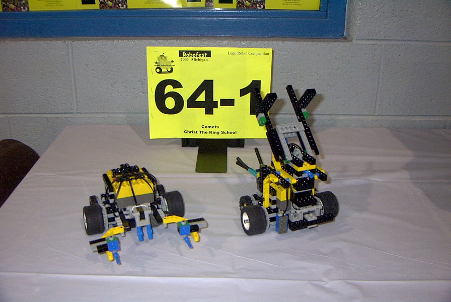
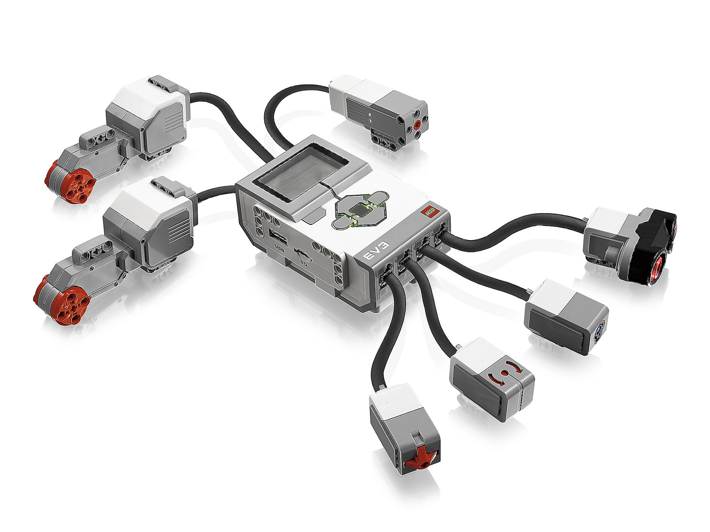
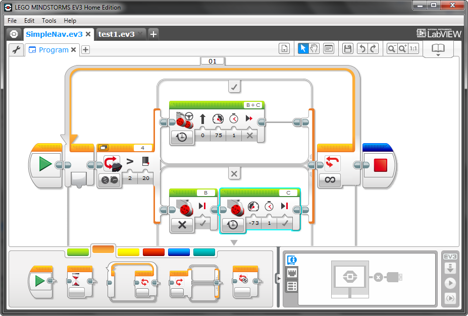
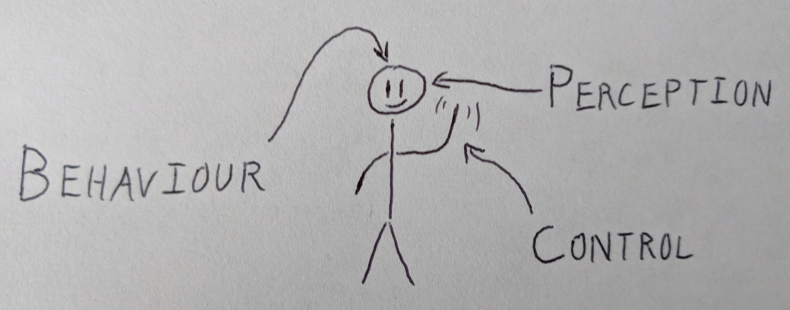
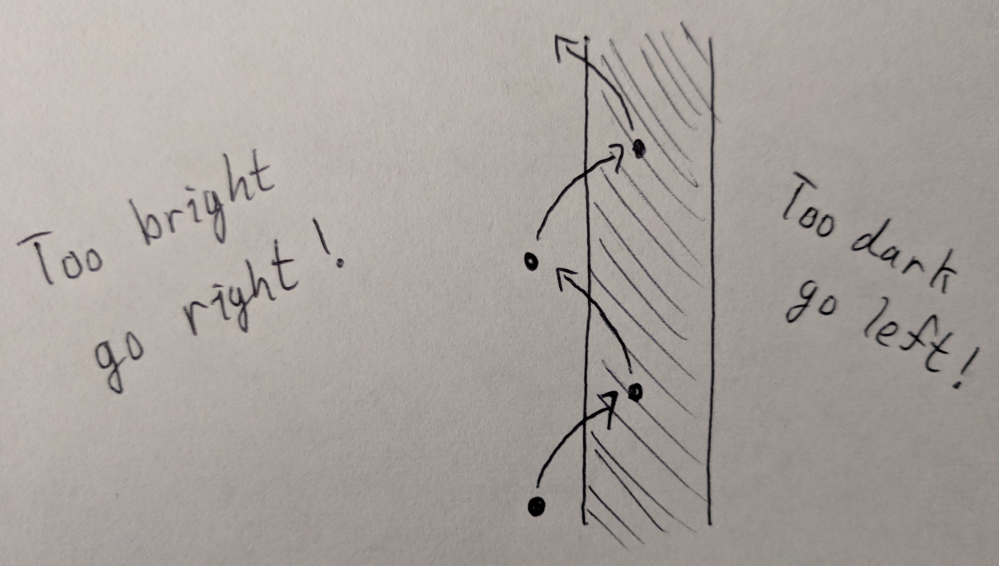
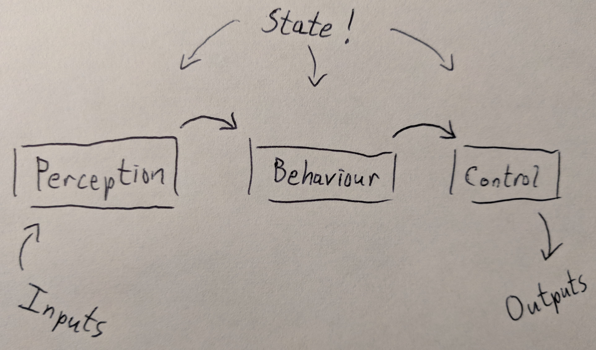
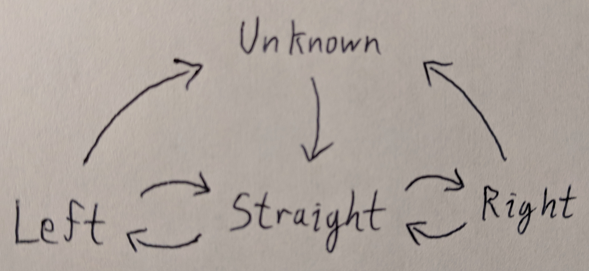
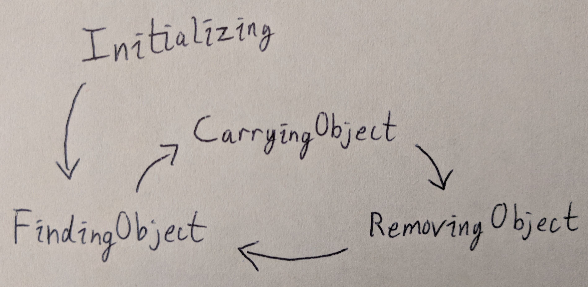

## A delightful language


## {data-background-image="./img/robofest.jpg"}

##



##



##



## ev3dev

(all the hard work I didn't have to do)

A Debian distribution for LEGO Mindstorms with API bindings for C,
C++, Python, Go, JavaScript

<https://www.ev3dev.org/>

<https://github.com/ev3dev/ev3dev>

## Questions

- _Can_ Elm be used to program a robot?
- Is it an _effective_ language for robots?
- Is it a _delightful_ language for robots?

## Robotics is about three things



## Mapping to the Elm architecture

```haskell
Browser.sandbox :
    { init : model
    , update : msg -> model -> model
    , view : model -> Html msg
    }
    -> Program () model msg
```

## An Elm program for robots

```haskell
Robot.program :
    { init : state
    , update : Input -> state -> state
    , output : state -> Output
    }
    -> Robot state

type alias Input =
    { lightSensor : Float, {- ... -} }

type alias Output =
    { leftMotor : Float, rightMotor : Float, {- ... -} }
```

## A simple robot

Follow a line

## Zig zag



## Follow a line

```haskell
update : Input -> State -> State
update input _ =
    { lightSensor = input.lightSensor
    }

output : State -> Output
output { lightSensor } =
    { leftMotor = lightSensor
    , rightMotor = 1.0 - lightSensor
    }
```

# Does it work?

# How does this work?

## Ports!

```haskell
port module Robot

port inputs : (Input -> msg) -> Sub msg

port outputs : Output -> Cmd msg
```

## Platform.worker

```haskell
type alias Config state =
    { init : state
    , update : Input -> state -> state
    , output : state -> Output
    }

program : Config state -> Robot state
program config =
    Platform.worker
        { init = \_ -> ( { state = config.init }, Cmd.none )
        , update = update config
        , subscriptions = \_ -> inputs NewInput
        }
```

## Wiring in Elm

```haskell
update : Config -> Msg -> Model -> ( Model, Cmd Msg )
update config msg model =
    case msg of
        NewInput input ->
            let
                newState =
                    config.update input model.state

                output =
                    config.output newState

            in
            ( { model | state = newState }, outputs output )
```

## Wiring in JavaScript

```js
function updateInput() {
  app.ports.inputs.send({
    lightSensor : lightSensor.reflectedLightIntensity,
    // ...
  });
}
function handleOutputs(outputs) {
  leftMotor.start(Math.round(SPEED * outputs.leftMotor));
  // ...
}
var app = Elm.Main.init();
app.ports.outputs.subscribe(handleOutputs);
setInterval(updateInput, 25);
```

## It's that simple!

# Let's make it more challenging!

## The challenge

- Follow a line around a track
- Grab things that you bump into
- Move them to the _outside_ of the track

##



## The model

```haskell
type alias Model =
    { perception : Perception
    , behaviour : Behaviour
    , control : Control
    }

init : Model
init =
    { perception = Perception.init
    , behaviour = Behaviour.init
    , control = Control.init
    }
```

## The update function

```{.haskell}
update input { perception, behaviour, control } =
   let
      -- Perception
      newPerception =
          Perception.update input perception

      -- Control
      newControl =
          Control.update newPerception control

      -- Behaviour
      ( newBehaviour, maybeControl ) =
         Behaviour.update newPerception newControl behaviour
   in
   { perception = newPerception
   , behaviour = newBehaviour
   , control = maybeControl |> Maybe.withDefault newControl
   }
```

## Perception turns raw data into meaningful information

## We need to detect...

- Have we encountered an obstacle?
- What direction are we going?

## Lots of things to measure

```haskell
module Perception

type alias Perception =
    { time : Int
    , claw : Claw.State
    , bumper : Bumper
    , wheels : WheelOdometers
    , curvature : Curvature.State
    , travelDirection : Maybe TravelDirection
    , lightSensor : Float
    }

update : Input -> Perception -> Perception
```

## Detecting obstacles

Just a boolean, but by a different name

```haskell
update : Input -> Perception -> Perception
update input perception =
    let
        bumper =
            if input.touchSensor then
                BumperPressed
            else
                BumperUnpressed
    in
    { bumper = bumper
    -- ...
    }
```

## Measure curvature

```haskell
module Curvature

type Curve = Unknown | Straight | Left | Right

type State
    = State
        { previous : Maybe { left : Int, right : Int }
        , curve : Curve
        , raw : Float
        , average : Float
        }
```

## Categorize curve



## Categorize curve

```haskell
calculateCurve : Float -> Curve -> Curve
calculateCurve curvature current =
    case current of
        Straight ->
            if curvature < -0.25 then
                Left

            else if curvature > 0.25 then
                Right

            else
                current
        -- ...
```

## We get lost!

```haskell
newCurve =
    calculateCurve average state.curve
        |> resetIfExtreme average

-- ...

resetIfExtreme : Float -> Curve -> Curve
resetIfExtreme curvature current =
    if abs curvature > 0.7 then
        Unknown

    else
        current
```

## Categorize direction

```haskell
type TravelDirection
    = Clockwise
    | CounterClockwise

type alias Perception =
    { curvature : Curvature.State
    , travelDirection : Maybe TravelDirection
    -- ...
    }
```

## Put it all together

```haskell
let
    curvature = Curvature.update {- ... -}

    travelDirection =
        case Curvature.curve curvature of
            Curvature.Unknown -> Nothing
            Curvature.Left -> Just CounterClockwise
            Curvature.Right -> Just Clockwise
            Curvature.Straight -> perception.travelDirection
in
{ travelDirection = travelDirection, -- ...
}
```

## Perception is...

- Often very functional
- Small state machines
- Sometimes computationally heavy

## Control makes things move

## Like a slightly stateful view function

```haskell
type alias Output =
    { leftMotor : Float
    , rightMotor : Float
    , clawMotor : Float
    }

-- module Control

update : Perception -> Control -> Control

output : Control -> Perception -> Output
```

## Control constrains the things the robot can do

```haskell
type Control
    = Idle
    | Grab Timer
    | Release Timer
    | FollowLine
    | MoveTo { left : Int, right : Int }
    | MoveBy { leftDelta : Int, rightDelta : Int }
```

## Some control is trivial

```haskell
idle : Control
idle = Idle

update : Perception -> Control -> Control
update perception control =
    case control of
        Idle ->
            control

output : Control -> Perception -> Input -> Output
output control perception input =
    case control of
        Idle ->
            { leftMotor = 0.0
            , rightMotor = 0.0
            , clawMotor = 0.0
            }
```

## Some control is stateless

```haskell
output : Control -> Perception -> Input -> Output
output control perception input =
    case control of
        FollowLine ->
            { leftMotor = perception.lightSensor
            , rightMotor = 1.0 - perception.lightSensor
            , clawMotor = 0.0
            , lights = Nothing
            }
```

## Some control is a bit stateful

```haskell
update : Perception -> Control -> Control
update perception control =
   case control of
      Grab Starting ->
         Grab (Since perception.time)

      Grab (Since startTime) ->
         if perception.time - startTime > grabDuration then
            Idle

         else
            control
```

## Some control uses state machines

```haskell
update : Perception -> Control -> Control
update perception control =
   case control of
      MoveBy { leftDelta, rightDelta } ->
         MoveTo
            { left = perception.wheels.left + leftDelta
            , right = perception.wheels.right + rightDelta
            }
      MoveTo { left, right } ->
         if within 5 left perception.wheels.left {-  -} then
            Idle
         else
            control
```

## Control is...

- Often very functional
- Small state machines
- Layered

## Behaviour is the core of your Elm application

##



## Behaviour is your model

```haskell
module Behaviour

type Behaviour
    = Initializing { openedClaw : Bool, closedClaw : Bool }
    | FindingObject
    | CarryingObject
    | RemovingObject (List Control)
```

## Behaviour is your update function

```haskell
module Behaviour

update :
    Perception
    -> Control
    -> Behaviour
    -> ( Behaviour, Maybe Control )
update perception currentControl behaviour =
    -- ...
```

## Behaviour should be _readable_

```haskell
case behaviour of
    FindingObject ->
        case ( claw, bumper) of
            ( Claw.Open, BumperPressed ) ->
                ( behaviour, Just Control.grab )

            ( Claw.Closed, _ ) ->
                ( CarryingObject, Nothing )

            _ ->
                ( behaviour, Just Control.followLine )
```

## Some behaviours are parameterized

```haskell
removeObject : TravelDirection -> Behaviour

type Behaviour
    = RemovingObject (List Control) | -- ...

case behaviour of
    CarryingObject ->
        case perception.travelDirection of
            Nothing ->
                ( behaviour, Just Control.followLine )

            Just travelDirection ->
                removeObject travelDirection
```

## Sequential actions are slightly awkward

When we find an obstacle, we need to...

- Grab it
- Turn
- Move forwards
- Let it go
- Move back
- Turn back

## We need feedback from control

```haskell
update perception currentControl behaviour =
   case behaviour of
      RemovingObject steps ->
         case ( Control.isIdle currentControl, steps ) of
            ( True, next :: remaining ) ->
               ( RemovingObject remaining, Just next )

            ( True, [] ) ->
               findObject

            ( False, _ ) ->
               ( behaviour, Nothing )
```

## Behaviour is...

- Stateful
- Symbolic
- Explainable

# Does it work?

# Wrapping Up

## Can Elm be used to program a robot?

Yes!

## Is it effective?

- Is Elm an effective _platform_ for robots?
- Is Elm an effective _language_ for robots?

## Is it delightful?

I think so!

Decide for yourself!

<https://github.com/adeschamps/programming-robots-with-elm/>

Slack: anthony.deschamps

anthony.j.deschamps@gmail.com

## Thank you!

Matt Griffith

Mike Onslow + Elm Detroit

<https://www.meetup.com/elm-detroit/>


